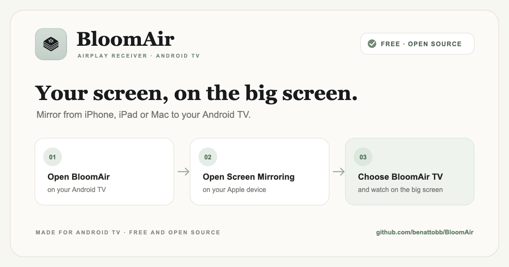

<p align="center">
  
</p>

<h1 align="center">BloomAir</h1>
<p align="center"><strong>Ultra-Low Latency AirPlay Receiver for Android TV (iPhone, iPad &amp; Mac)</strong></p>

An open-source Android TV application that lets you use the built-in Screen Mirroring controls on an iPhone, iPad, or Mac to connect to an Android TV. BloomAir provides Apple **AirPlay screen mirroring**, **video streaming**, and **audio playback**. Actual latency depends on the TV hardware and Wi-Fi network.

---

## ✨ Features

* **Simple TV-ready interface**: A clear receiver status, easy-to-read connection instructions, and remote-friendly controls in a calm charcoal-and-sage palette.
* **Animated launch background**: A real-time shifting mesh gradient on launch and standby.
* **Ubuntu Font Family**: Modern, rounded typography optimized for 10-foot television readability.
* **Low-Latency Pipeline**:
  * `TCP_NODELAY = true` (Disables Nagle packet buffering).
  * Hardware `MediaCodec` decoding runs on its own thread and outputs directly to `SurfaceView`.
  * Oboe requests Android's low-latency audio path, with a jitter cushion to reduce dropouts.
  * A Wi-Fi performance lock is held while receiving. Actual latency depends on the TV, sender, and network.
* **Custom App Icon & TV Banner**: High-density adaptive icons and TV banners featuring the frosted squircle and black layered flower motif.

---

## 🚀 Fast Track: 3 Ways to Get Started

### Option 1: 1-Click Wireless Install via ADB from your Mac (Fastest)

If your Mac and Android TV are on the same Wi-Fi network:

1. **Enable Developer Options on Android TV**:
   - Go to **Settings** > **Device Preferences** (or **System**) > **About**.
   - Click **Android TV OS build** **7 times** until you see *"You are now a developer"*.
   - Return to **Settings** > **System** > **Developer Options** and turn **ON** **Wireless Debugging**.

2. **Run the guided pairing tool from Terminal**:
   ```bash
   cd ~/Documents/BloomAir
   ./scripts/pair_and_deploy.sh
   ```
   *(Enter the 5-digit port and 6-digit Wi-Fi pairing code shown on your TV screen).*

---

### Option 2: Build & Customize from Source

This repository contains a full Android TV application ready for Android Studio:
1. Open **Android Studio**.
2. Select **Open** and choose this repository's `BloomAir` directory.
3. Connect your Android TV or an Android TV emulator and click **Run** (`Shift + F10`).

---

## 📱 How to Connect from your iPhone, iPad, or Mac

Once BloomAir is running on your Android TV:

### From your iPhone or iPad:
1. Ensure your iPhone or iPad is connected to the **same Wi-Fi network** as your Android TV.
2. Swipe down from the top-right corner (or swipe up from the bottom on older iPhone models) to open **Control Center**.
3. Tap the **Screen Mirroring** icon.
4. Select **"BloomAir TV"**.

### From your Mac:
1. Ensure your Mac is connected to the **same Wi-Fi network**.
2. Click the **Control Center** icon in the top macOS menu bar.
3. Click **Screen Mirroring** and select **"BloomAir TV"**.
4. Choose whether to **"Mirror Built-in Display"** or use the TV as an **"Extended Display"**.

---

## 🎨 Design & Artwork Assets

### BloomAir in use



The artwork illustrates the simple flow: open BloomAir on the TV, choose **BloomAir TV** from Screen Mirroring on an iPhone, iPad, or Mac, and watch on the television.

### App Icon & TV Banner

<p align="center">
  
  &nbsp;&nbsp;&nbsp;&nbsp;&nbsp;&nbsp;
  
</p>

* **App Icon**: [`app/src/main/res/drawable/ic_bloomair_512.png`](app/src/main/res/drawable/ic_bloomair_512.png) — icon artwork created by [koboyo](https://github.com/koboyo); the adaptive launcher variants are generated from the same mark.
* **Android TV Banner**: [`app/src/main/res/drawable/banner_bloomair.png`](app/src/main/res/drawable/banner_bloomair.png)
* **Typography**: [`app/src/main/res/font/ubuntu.xml`](app/src/main/res/font/ubuntu.xml)
* **Moving Gradient Background**: [`app/src/main/java/com/airplay/tv/ui/MovingGradientView.kt`](app/src/main/java/com/airplay/tv/ui/MovingGradientView.kt)

## Device Testing and Troubleshooting

See [docs/DEVICE_TESTING.md](docs/DEVICE_TESTING.md) for build, wireless installation, AirPlay discovery checks, and connection diagnostics.

---

## 📜 License & Attribution

BloomAir is licensed under the [GNU General Public License v3.0](LICENSE) (GPL-3.0).

### Upstream Credits & Acknowledgments
- Based upon and inspired by [android-airplay-server](https://github.com/jqssun/android-airplay-server) by [jqssun](https://github.com/jqssun), licensed under GPL-3.0.
- App icon artwork designed and credited to [koboyo](https://github.com/koboyo).
- Core audio and low-latency pipeline utilizes [Google Oboe](https://github.com/google/oboe).
